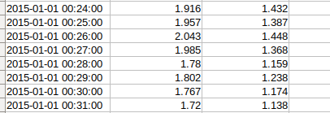

# 1. Motivácia
Počasie patrí medzi najvýraznejšie faktory, ktoré vplývajú na ľudksý život na Zemi. Človek sa odjakživa snažil čo najpresnejšie predpovedať počasie práve kvôli jeho veľkému vplyvu na život každého jedinca. Od predpovedi počasia sú v súčasnosti takisto závislé mnohé odvetvia, či už poľnohospodárstvo, doprava(letecká, lodná), výroba elektrickej energie (veterné elektrárne a solárne panely) a mnohé ďalšie. Z týchto dôvodov je čo najpresnejšia predpoveď počasia veľmi dôležitá.

V posledných rokoch sa začala na predpoveď počasia využívať nová technika - predpoveď pomocou neurónových sietí. Pri predpovedi počasia ide prakticky o predikciu časových radov. Kvôli premenlivosti sa počasia sa často na tieto problémy využívajú rekurentné neurónové siete.

V našom projekte sme sa rohodli zaoberať predikciou časových radov a teda predpoveďou počasia. Našim cieľom je využiť rekurentné neurónové siete.

# 2. Súvisiaca práca
- *Sequence to Sequence Weather Forecasting with Long Short-Term Memory Recurrent Neural Networks 2016*

V tejto práci sa autori zaoberajú predikciou počasia pre 9 miest v Maroku. Snažia sa o predpoveď teploty, vlhkosti a rýchlosti vetra na dva časové intervaly - 24 a 72 hodín. Používajú pri tom LSTM neurónové siete, ktoré patria do skupiny rekurentných neurónových sietí.

Na natrénovanie modelu neorónovej siete použili približne 15 rokov meteorologických dát, ktoré boli zaznamenané v časovom intervale jednej hodiny. Model dosiahol dobrú úspešnnosť predpovedí, porovnateľnú s úspešnosťou metód, ktoré sa na predpoveď počasia používajú v dnešnej dobe. Hodnoty sú v minutových intervaloch a zaokrúhlené na tri desatinné miesta.

Ďalšie práce v tejto oblasti:
- *An ensemble of neural networks for weather forecasting 2004*
- *An Efficient Weather Forecasting System using Artificial Neural Network 2010*

# 3. Dataset
Náš dataset, obsahuje milióny dát. Konkrétne ale chceme pracovať zo začiatku s teplotou. Tento dataset sme získali z Institut für Geowissenschaften, inštitút je na Rheinischen Friedrich-Wilhelms-Universität Bonn, čo je univarzita v nemeckom Bonn-e. 

## Vstupný obrázok:

# 4. Návrh riešenia
Náš model sa bude skladať z viacvrstvovej rekurentnej neurónovej siete. Túto sieť budeme trénovať na vopred opísanom datasete a chceme aby predikovala teplotu a iné meteorologické dáta na pár dní dopredu.
