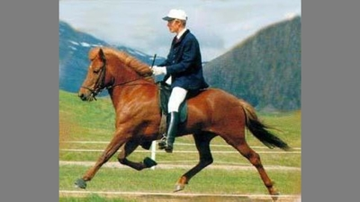
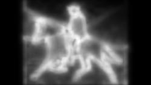

# 1. Motivácia
Vizuálne vnímanie človeka je zahlcované množstvom informácii z nášho okolia, ktoré musí náš nervový systém neustále spracovávať. 
Kapacita nervového systému nie je dostatočná na spracovanie všetkých prichádzajúcich stimulov, 
preto vizuálne vnímanie človeka vyberá na ďalšie spracovanie iba tie najdôležitejšie podnety. 
Sledovanie vizuálnej pozornosti človeka je dôležitý pre veľké množstvo aplikačných oblastí, 
kde má modelovanie vizuálnej pozornosti nezameniteľný význam. Pre aplikovanú informatiku sú najvýznamnejšie aplikácie takýchto modelov v robotike, pri predikcii správania človeka, alebo používateľa informačných systémov a v autonómnej doprave. 
V našej práci chceme vytvoriť a natrénovať model, ktorý bude predikovať časti obrázku, na ktoré sa bude používateľ najčastejšie pozerať. 
# 2. Súvisiaca práca
*Shallow and Deep Convolutional Networks for Saliency Prediction 2016* Táto práca využíva na riešenie problému konvolučnú neurónovú sieť.
Autori vytvorili dva prístupy, plytkú konvolučnú neurónovú sieť, natrénovanú od základu a zložitejsí model, ktorého prvé tri vrstvy
boli adaptované z inej neurónovej sieti natrénovanej na klasifikáciu. Táto práca bola prvá v oblasti predikcie vizuálnej pozornosti, ktorá na riešenie použila "end-to-end" konvolučnú neurónovú sieť. 
# 3. Dataset
Vstupný dataset obsahuje 4000 obrázkov z dvadsiatich rôznych kategórií, ako napríklad Object, Pattern, Social, Art atď.
Obrázky sú rozdelené do dvoch rovnako veľkých skupín po 2000 obrázkov - vstupné a výstupné. Veľkosť jednotlivých obrázkov je 1920 x 1080px. Taktiež obsahuje body, na ktoré sa ľudia pri jetnotlivých obrázkoch pozerali.

## Vstupný obrázok:

## Výstupná saliency mapa:

# 4. Návrh riešenia
Náš model sa bude skladať z viacvrstvovej konvolučnej neurónovej siete. Túto sieť budeme trénovať na vopred opísanom datasete a chceme aby predikovala miesta, kde sa budú ľudia najčastejšie pozerať.
